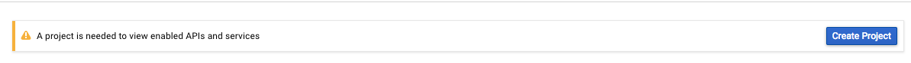

# csss-site-in-dev

In active development on Jace Manshadi's personal AWS account.
### Table of Contents
 - [Basic Instructions for Site set-up]
 - [Generating Access Token for gmail inbox]
 - [Automation of auto-refreshing the gmail access token]
 - [Miscellanious/Extra References]

### Basic Instructions for Site set-up
  
By: Jace Manshadi  
Position: Webmaster Summer 2017 - Present  
contact: j_manshad@sfu.ca  
  
The site was set up with help from YouTube tutorial: https://www.youtube.com/playlist?list=PLQVvvaa0QuDeA05ZouE4OzDYLHY-XH-Nd   
  
Also avaiable here: https://pythonprogramming.net/django-web-development-with-python-intro/  
  
These instructions were carried out on a VM on AWS with the Ubuntu 16.04 O.S.  
  
ssh -i csssWebsiteKeyPair.pem ubuntu@ec2-52-91-226-24.compute-1.amazonaws.com  
sudo apt install python3-pip  
pip3 install -U pip  
pip3 install django  
mkdir csss_website  
cd csss_website/  
django-admin startproject csss  
made following commit:  
add following host to settings.py  
        ALLOWED_HOSTS = ['ec2-52-91-226-24.compute-1.amazonaws.com']  
python3.5 manage.py runserver 172.31.17.191:8000  
python3.5 manage.py startapp webapp  
python3.5 manage.py runserver 172.31.17.191:8000  
python3.5 manage.py startapp personal  
   
### Generating Access Token for gmail inbox
  
#### Creating Developer Project and client ID and client secret using csss.website account  
https://console.developers.google.com/apis/dashboard  
Create Project  
  
Select GMAIL API  
  
Enable GMAIL API  
  
Create Credentials  
  
Creating client ID  
  
Configure Consent Screen  
  
Creating OAuth consent screen  
  
Selecting client ID Application Type  
  
Copy Client ID and client secret  
  
  
#### ouath2.py script for generating Access Token
Instructions: [OAuth2DotPyRunThrough](https://github.com/google/gmail-oauth2-tools/wiki/OAuth2DotPyRunThrough)
```shell
wget https://raw.githubusercontent.com/google/gmail-oauth2-tools/master/python/oauth2.py
```

## access token and gmail for dango-mailbox  
I am currently testing the usefulness of django-mailbox module to be able to recieve emails at the django site.  
Unfortunately, that module doesnt actually store the credentials itself and instead relies on [python-social-auth](https://github.com/python-social-auth) for credentials. THis is unfortunate because the documentation for that module is complicated as hell and I am not currently able to make heads or tails of how to utilize it for the csss-site.  
  
However, I have come up with an extremely hacky-solution of allowing the site to retrieve emails, involves modifying `/usr/local/lib/python3.5/dist-packages/django_mailbox/transports/gmail.py` which I strongly suspect is not a good thing, modfying source files for a module but thats just how it currently is being done.  
  
Modifications are outlined here  
  
```shell
    def _connect_oauth(self, username):
        # username should be an email address that has already been authorized
        # for gmail access
        try:
            from django_mailbox.google_utils import (
                get_google_access_token,
                fetch_user_info,
                AccessTokenNotFound,
            )
        except ImportError:
            raise ValueError(
                "Install python-social-auth to use oauth2 auth for gmail"
            )
        access_token = None
        while access_token is None:
            try:
#                access_token = get_google_access_token(username)
                access_token = '#######################################################' <-- hard_corded acccess token **NOT GOOD PRACTICE**
                google_email_address = 'csss.website@gmail.com' <-- hard_coded gmail **NOT GOOD PRACTICE**
#                google_email_address = fetch_user_info(username)['email']
            except TypeError:
                # This means that the google process took too long
                # Trying again is the right thing to do
                pass
            except AccessTokenNotFound:
                raise ValueError(
                    "No Token available in python-social-auth for %s" % (
                        username
                    )
                )
```

### Automation of auto-refreshing the gmail access token

`sudo find / -name django_mailbox` to locate the location of the module

add the file gmail-1 and gmail-2 to the transports folder under the django_mailbox folder

add the following line to crontab using `crontab -e`

`sudo -H python3.5 /home/ubuntu/csss_website/access_token_refresher.py`

correct the paths of gmail.py, gmail-1 and gmail-2 in access_token_refresher.py

run the command `wget <oauth2.py_path>` inside of the top csss_website. You can determine the path from [this repo wiki](https://github.com/google/gmail-oauth2-tools/wiki/OAuth2DotPyRunThrough)

also need to enter the absolute path for the csss directory into PYTHONPATH like so:  
`export PYTHONPATH=/home/ubuntu/csss_website/csss/csss/`

### Miscellanious/Extra References

*******************
*** Django Docu ***
*******************

Step by Step for using oauth2 script: https://github.com/google/gmail-oauth2-tools/wiki/OAuth2DotPyRunThrough
http://python-social-auth.readthedocs.io/en/latest/
http://python-social-auth.readthedocs.io/en/latest/configuration/index.html
http://python-social-auth.readthedocs.io/en/latest/configuration/settings.html
http://python-social-auth.readthedocs.io/en/latest/configuration/django.html
http://python-social-auth.readthedocs.io/en/latest/configuration/porting_from_dsa.html
http://python-social-auth.readthedocs.io/en/latest/pipeline.html
http://python-social-auth.readthedocs.io/en/latest/pipeline.html#extending-the-pipeline
http://python-social-auth.readthedocs.io/en/latest/strategies.html
http://python-social-auth.readthedocs.io/en/latest/storage.html
http://python-social-auth.readthedocs.io/en/latest/exceptions.html
http://python-social-auth.readthedocs.io/en/latest/backends/index.html
http://python-social-auth.readthedocs.io/en/latest/backends/google.html#google-oauth2
http://python-social-auth.readthedocs.io/en/latest/developer_intro.html
http://python-social-auth.readthedocs.io/en/latest/logging_out.html
http://python-social-auth.readthedocs.io/en/latest/tests.html
http://python-social-auth.readthedocs.io/en/latest/use_cases.html

http://django-mailbox.readthedocs.io/en/latest/
http://django-mailbox.readthedocs.io/en/latest/topics/mailbox_types.html#gmail-imap-with-oauth2-authentication
http://django-mailbox.readthedocs.io/en/latest/topics/mailbox_types.html
https://github.com/python-social-auth/social-app-django
https://github.com/coddingtonbear/django-mailbox

**************************************************
*** UPDATING MIGRATIONS FOR PYTHON-SOCIAL-AUTH ***
*** https://stackoverflow.com/a/42946678       ***
**************************************************

*******************
*** Google Docu ***
*******************
https://developers.google.com/gmail/imap/xoauth2-protocol
https://developers.google.com/gmail/imap/xoauth2-libraries
https://developers.google.com/gmail/imap/xoauth2-protocol
https://developers.google.com/apis-explorer/?hl=en_US#p/gmail/v1/
https://support.google.com/googleapi/answer/6158849?hl=en#installedapplications&android
https://console.developers.google.com/apis/credentials?project=gmail-csss-api-links
https://developers.google.com/identity/protocols/OAuth2