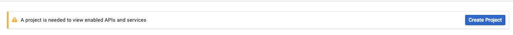

# Steps for Generating Access Token for gmail inbox
  
## Creating Developer Project and client ID and client secret using csss.website account  
https://console.developers.google.com/apis/dashboard  
Create Project  
  
Select GMAIL API  
  
Enable GMAIL API  
  
Create Credentials  
  
Creating client ID  
  
Configure Consent Screen  
  
Creating OAuth consent screen  
  
Selecting client ID Application Type  
  
Copy Client ID and client secret  
  
  
## ouath2.py script for generating Access Token
Instructions: [OAuth2DotPyRunThrough](https://github.com/google/gmail-oauth2-tools/wiki/OAuth2DotPyRunThrough)
```shell
wget https://raw.githubusercontent.com/google/gmail-oauth2-tools/master/python/oauth2.py
```