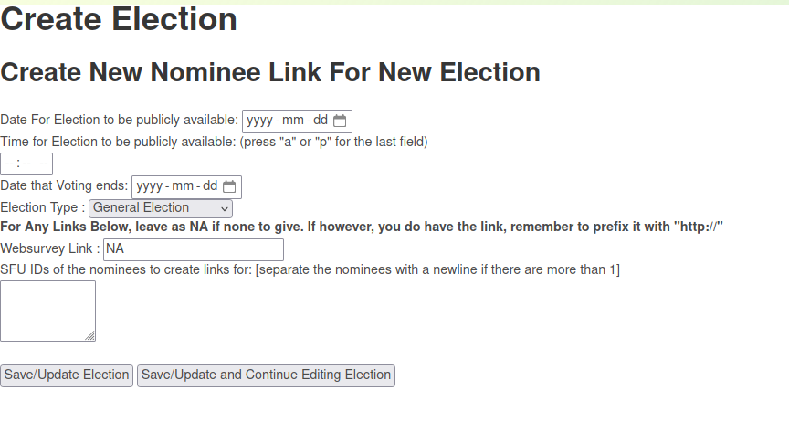
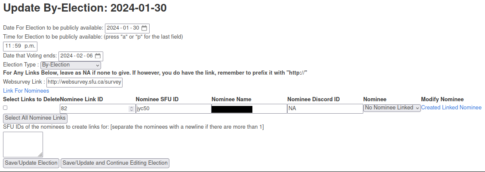
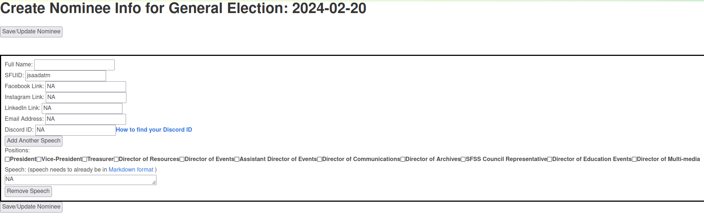
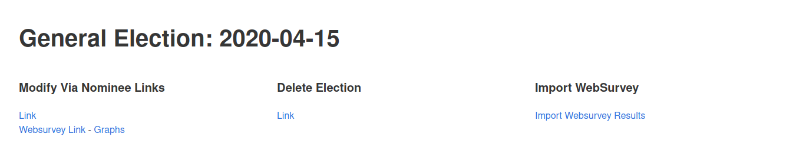
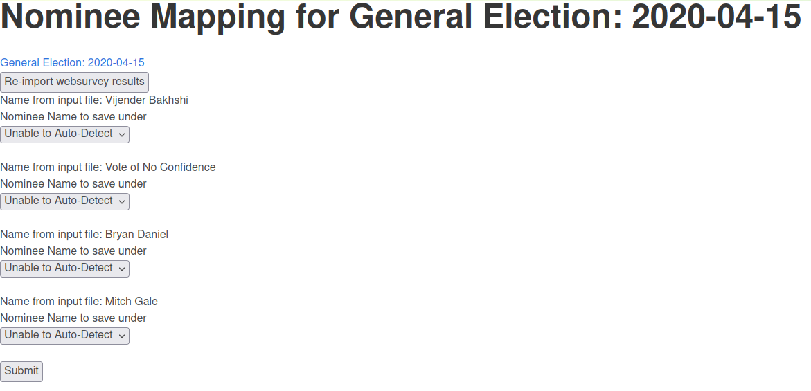
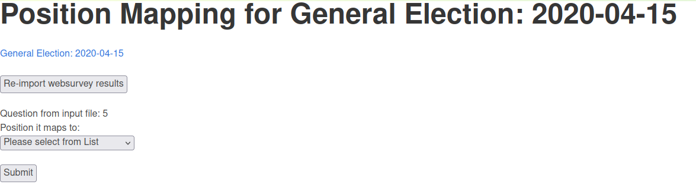
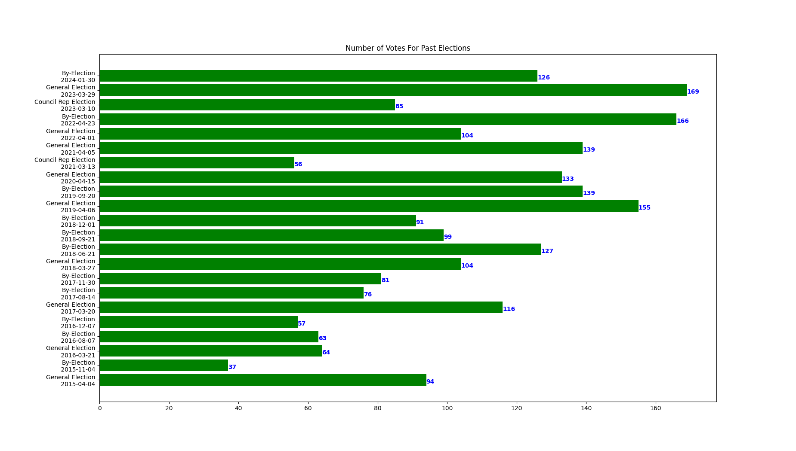
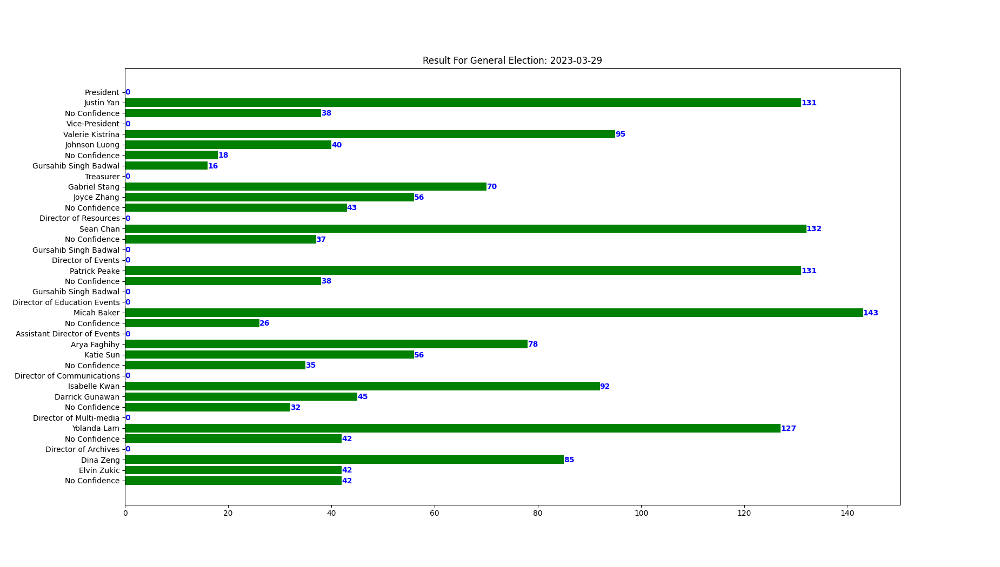
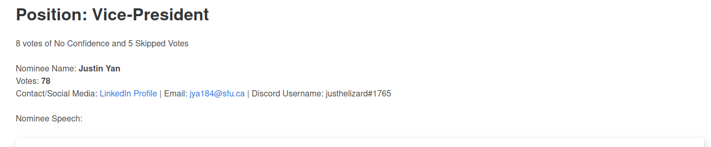

# Elections App

## Responsible for

 - [Models Needed for the Public Election Page](#models-needed-for-the-public-election-page)
 - [1. Allow Election Officer to setup an Election](#1-allow-election-officer-to-setup-an-election)
   - [1.1. Fun Fact: Websurvey can't handle any logins from an SFU account that has a password longer than 32 character](#11-fun-fact-websurvey-cant-handle-any-logins-from-an-sfu-account-that-has-a-password-longer-than-32-character)
 - [2. Allow Election Officer to setup a Nominee Link](#2-allow-election-officer-to-setup-a-nominee-link)
   - [2.1. What does "NomineeLink" mean?](#21-what-does-nomineelink-mean)
 - [3. Page where Election Officer or Nominee can upload the nominee speeches and select the positions they want to run for](#3-page-where-election-officer-or-nominee-can-upload-the-nominee-speeches-and-select-the-positions-they-want-to-run-for)
 - [4. Ensure Elections are publicly available](#4-ensure-elections-are-publicly-available)
 - [5. Allow Election Officer to record the Final Results](#5-allow-election-officer-to-record-the-final-results)
   - [5.1. Explanation of Workflow and Entity Relationships](#51-explanation-of-workflow-and-entity-relationships)
   - [5.2. Screenshots for uploading websurvey results](#52-screenshots-for-uploading-websurvey-results)
 - [6. Provide Graphs and Show Results](#6-provide-graphs-and-show-results)
 - [7. Background Cron Commands](#7-background-cron-commands)
   - [7.1. Remind Election Officer to Provide Websurvey Link](#71-remind-election-officer-to-provide-websurvey-link)
   - [7.2. Nag Election Officer Share Results](#72-nag-election-officer-share-results)

# Models Needed for the Public Election Page
https://docs.google.com/drawings/d/1TzEkZVp0kEe7rf90qAUzB3Wz38sC4JktiZncKoxfrAE/edit?usp=sharing

Pretty much all the fields above are self-explainable, but I will do a bit of elaboration on 2 in specific:
* **date**: This is essentially the start date of the vote. No one can see the nominees before this date.
* **end_date**: This is the last day to vote. This is necessary because of 2 things
  * After this date, the election office is repeatedly reminded to share the websurvey results with the `csss` account and also 
  * upload the results to the website

# 1. Allow Election Officer to setup an Election

#### 1.1. Fun Fact: Websurvey can't handle any logins from an SFU account that has a password longer than 32 character

Election Officer documentation is located [here](https://sfucsss.org/elections/election_officer_documentation)

A New Election is Setup at https://sfucsss.org/elections/new_election_via_nominee_links/

Models created when setting up an election in preparation for nominees  

https://docs.google.com/drawings/d/16FF7UFHa8E19YaJ5Y3wnMk2SwD9FlL5Yj9kWPBoK1nY/edit?usp=sharing

# 2. Allow Election Officer to setup a Nominee Link

## 2.1 What does "NomineeLink" mean?

Originally, the nominees were emailing their nominee speeches to the election officer who would then be stuck having to manually upload everyone's speeches.

In order to remove the burden from the Election Officer and have the nominees do that themselves, I introduced the concept of a `NomineeLink`. This refers to the fact that for every nominee in an election, I needed a way to authenticate a user so that they had the ability to add a speech to only their nominee profile.
Without a trusty way to ensure that a user is who they say they are, I relied on passphrases to authenticate them. The idea being that when an election officer generated a nominee, there would be a special URL with a nominee-specific passphrase in that URL that the election officer would share with that nominee. Therefore as long as that URL was not compromised, the nominee could use it to reliably update their info on the site. And since the passphrase was a piece of data that was only necessary before voting had started,
I decided rather than add it to the `Nominee` object , I'd rather add it temporarily to the `NomineeLink` object and link that to `Nominee` and then setup the workflow so that once an election is over, the `NomineeLink` can be safely deleted without any effect on `Nominee`.

**However**, once I learned how to authenticate users against SFU's CAS system, I realized I can revamp that system by making the `passphrase` unnecessary and instead, link the user based on their SFUID.

By which I mean that when a user logs in via their SFU credentials, their username on our website is their SFUID, so the correct `NomineeLink` could now be narrowed down just via their SFUID rather than via a passphrase.

So, technically, at this point, the `NomineeLink` object is not actually needed, but I didn't have time to remove it.

So currently, the models used for the NomineeLinking mechanism are
https://docs.google.com/drawings/d/1Y69DkOl3An8dzETV5rctShog__NFnXjjkFU-bHXeswo/edit?usp=sharing

The way that I programmed this was that on this page  
https://sfucsss.org/elections/2024-01-30-by_election/election_modification_nominee_links/

the election officer would add the SFUID to `SFU IDs of the nominees to create links for: [separate the nominees with a newline if there are more than 1]` field. and then click `Save/Update and Continue Editing Election`

# 3. Page where Election Officer or Nominee can upload the nominee speeches and select the positions they want to run for

https://sfucsss.org/elections/2024-01-30-by_election/election_modification_nominee_links/

When it comes to updating the nominee info
* the election officer can either add the nominee info themselves using the `Created Linked Nominee` if the nominee isn't yet recorded 
* or **IF** a corresponding nominee exists, select the existing nominee from the **Nominee** dropdown menu 
* or **IF** the nominee wants to just upload their info themselves, they can be given the link http://sfucsss.org/login?next=/elections/create_or_update_via_nominee_links_for_nominee which is stored within the hyperlink `Link for Nominees`

Whether it be the election officer or nominee, both are presented the following view to create or update a nominee's name

Models Used for recording Nominee info via NomineeLink mechanism
https://docs.google.com/drawings/d/1WBwa8acIEW_QW0L97kMmRuVxDvasuTJ8Mt3edhPCDt0/edit?usp=sharing

# 4. Ensure Elections are publicly available

To ensure that the election officer does not forget to add the websurvey link to an election, if an election does not contain a websurvey link, then the page won't be publicly available

# 5. Allow Election Officer to record the Final Results

## 5.1. Explanation of Workflow and Entity Relationships

So, I always wanted to have the website itself also contain the results, giving us the option for nice pretty graphs and analytics and so forth.

Unfortunately, since the websurvey program is soooo fucking old, it really wasn't setup to have any APIS, so the only way to get the results was for the Election Officer to manually upload the data :disappointed:

The 2 main considerations I had to make to allow for this was:
1. How to handle differences in names. Like what if a nominee's name on the website is "Jace" but the election officer accidentally called them `Jason` on the websurvey. So when uploading the websurvey data, the website would see "Jason" and would just go "well, idk what that is 🤷🏿‍♀️"  
   1. To tackle this issue, I had to add the field `nominee_name_mapped` to `PendingVoterChoice`
1. Also, if there are more than 1 position relevant to the election, then the export from websurvey has more than 1 question and that may create a situation where the website can't figure out which column is for which question/position.

So for each vote, **not each voter**, for each vote, the website first creates a `PendingVoterChoice` object with 
* `full_name` set to the name detected in the websurvey export
* `websurvey_column`: set to the index of the column that the vote was in the websurvey export
* `nominee_name_mapped`: set to `False` if there was not a `Nominee` found for the specified election with the exact same name.

Then the website tries to see if it can isolate all `PendingVoterChoice` for a specific `websurvey_column` and if such a list of objects all have `nominee_name_mapped` set to `True`. If that is the case then it tries to see based on deduction, if it can guess what position that `websurvey_column` is mapped to.

Assuming it can do that for at least 1 `websurvey_column`, the website then creates a `WebsurveyColumnPositionMapping` with the specified `websurvey_column`, `position_name` and relevant `election`.

Once all `PendingVoterChoice`s have all their `nominee_name_mapped` [which is assisted by Nominee Mapping page seen below] and all the `websurvey_column` have a corresponding `WebsurveyColumnPositionMapping` created for them, the website then works it ways through all the `PendingVoterChoice` converts it each to a `VoterChoice` and then finally deletes all the `PendingVoterChoice` and `WebsurveyColumnPositionMapping` associated with that election.

Models used to go through the process of uploading final results

https://docs.google.com/drawings/d/1xsNH7-qUiDKjgcC6FvOgWZ8QOq6RMgEEuHMkYBb-nsg/edit?usp=sharing

## 5.2. Screenshots for uploading websurvey results
1. The Election Officer has to go to the election's page [https://sfucsss.org/elections/2020-04-15-general_election/] and click on `Import Websurvey Results`

2. The election officer would then upload the txt file and if there are any names in the export that don't match any recorded nominees, the election officer is presented the following page:

3. Then the election officer [if the website can't figure it out automatically] has to specify what position a question on the websurvey was for.

# 6. Provide Graphs and Show Results

Do this however you want, but with the importing of results from websurvey, I was then able to do stuff like provide these graphs

and also provide this kind of data on the election page where the nominees under each position is sorted by number of votes in descending order

# 7. Background Cron Commands

## 7.1. Remind Election Officer to Provide Websurvey Link
[remind_election_officer_to_provide_websurvey_link.py](management/commands/remind_election_officer_to_provide_websurvey_link.py)
sends a reminder to the election officer to add a websurvey link to an election so that it can be shown publicly

## 7.2. Nag Election Officer Share Results
[nag_election_officer_share_results.py](management/commands/nag_election_officer_share_results.py)
Nag the election officer to share the election results once the `end_date` for an election has passed