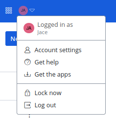
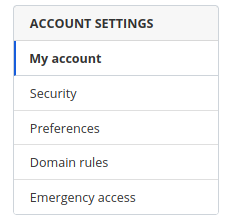
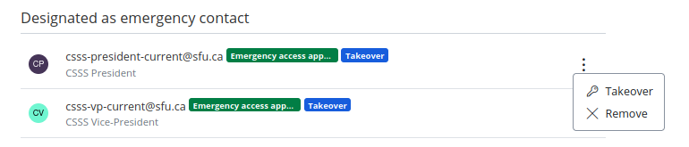
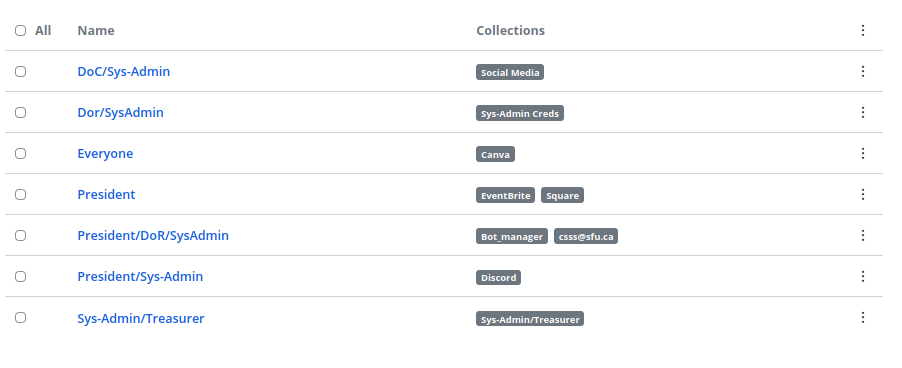
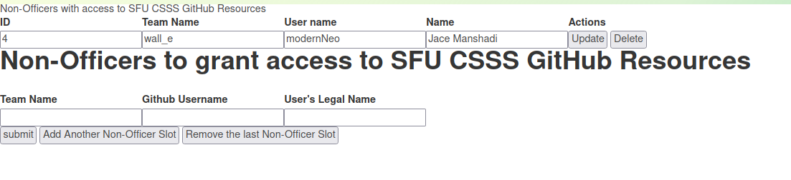
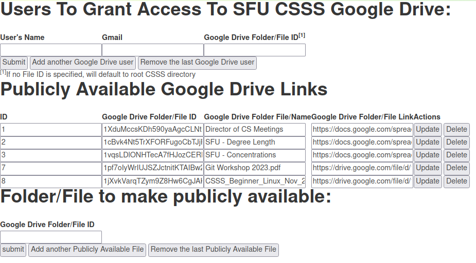
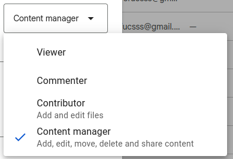

# Resource Management App

## Responsible For
 - [1. Officer Resource Management](#1-create-officer-github-team-mapping)
   - [1.1. Officer GitHub Team Mapping](#11-officer-github-team-mapping)
     - [1.1.1. Explanation of Table](#111-explanation-of-table)
     - [1.1.2. Permission Levels that are manually set in GitHub for the GitHub Team in above table](#112-permission-levels-that-are-manually-set-in-github-for-the-github-team-in-above-table)
     - [1.1.3. When Past Officers lose their access to GitHub resources](#113-when-past-officers-lose-their-access-to-github-resources)
   - [1.2. Google Drive Workspace Shared Team Drives for Officers](#12-google-drive-workspace-shared-team-drives-for-officers)
   - [1.3. Code workflow when officer inputs their information](#13-code-workflow-when-officer-inputs-their-information)
     - [1.3.1. GitHub Permission Management](#131-github-permission-management)
     - [1.3.2. Google Workspace Shared Team Drive Permission Management](#132-google-workspace-shared-team-drive-permission-management)
   - [1.4. Bitwarden Account Permission Management upon Takeover](#14-bitwarden-account-permission-management-upon-takeover)
     - [1.4.1. Re-assign access to collections after account take-over](#141-re-assign-access-to-collections-after-account-take-over)
     - [1.4.2. Things I never got around to doing](#142-things-i-never-got-around-to-doing)
 - [2. Non Officer Permission Management](#2-non-officer-permission-management)
   - [2.1. Non-Officer GitHub Team Members](#21-non-officer-github-team-members)
     - [2.1.1 Limitations of the page](#211-limitations-of-the-page)
     - [2.1.2. Things I never got around to doing](#212-things-i-never-got-around-to-doing)
   - [2.2. Non-Officer Google Workspace Shared Team Drive Permission Management](#22-non-officer-google-workspace-shared-team-drive-permission-management)
     - [2.2.1 Limitations of the page](#221-limitations-of-the-page)
     - [2.2.2. Things I never got around to doing](#222-things-i-never-got-around-to-doing)
 - [3. Background Cron Commands](#3-background-cron-commands)
   - [3.1. Validate GitHub Access](#31-validate-github-access)
   - [3.2. Validate Access to the Team Drive for Deep-Exec](#32-validate-access-to-the-team-drive-for-deep-exec)
   - [3.3. Validate Access to the Team Drive for General Documents](#33-validate-access-to-the-team-drive-for-general-documents)
   - [3.4 Validate Access to Public Gallery](#34-validate-access-to-public-gallery)

# 1. Officer Resource Management

## 1.1. Officer GitHub Team Mapping
Set at :https://sfucsss.org/about/github_mapping

the GitHub team mappings I decided on was

| Officers                                                                                                                                                                                                                                                                                                                                                                                                                                                                                                  | Github Team      | Past Terms that are relevant |
|-----------------------------------------------------------------------------------------------------------------------------------------------------------------------------------------------------------------------------------------------------------------------------------------------------------------------------------------------------------------------------------------------------------------------------------------------------------------------------------------------------------|------------------|------------------------------|
| Director of Archives                                                                                                                                                                                                                                                                                                                                                                                                                                                                                      | doa              | 0                            |
| <li>General Election Officer</li><li>By-Election Officer</li>                                                                                                                                                                                                                                                                                                                                                                                                                                             | election_officer | 0                            |
| <li>President</li><li>Vice-President</li><li>Treasurer</li><li>Director of Resources</li><li>Director of Events</li><li>Director of Education Events</li><li>Assistant Director of Events</li><li>Director of Communications</li><li>Director of Multi-media</li><li>Director of Archives</li><li>Executive at Large 1</li><li>Executive at Large 2</li><li>First Year Representative 1</li><li>First Year Representative 2</li><li>Frosh Week Chair</li><li>Systems Administrator</li><li>Webmaster</li> | officers         | 5                            |

### 1.1.1. Explanation of Table
1. **Officer**: officer positions that need to be given access to the github officer team
2. **GitHub team**: name of the GitHub officer team
3. **Past Terms that are relevant**: number of previous terms of officers who have to continue to have access. For example, the `doa` team will only ever contain the current Director of Archives. But if it's number was changed to `1`, then it would contain both the current and whichever officer was the Director of Archives in the previous term.

### 1.1.2. Permission Levels that are manually set in GitHub for the GitHub Team in above table
**Just to be clear, the only thing the website enforces is just what teams exist and who is in the team, I never got around to setting up the website so that it also dictates what GitHub teams have what level of access to what repos**
* As such, the following permission types are manually set by me
  * **doa**: `WRITE` access to https://github.com/CSSS/minutes
  * **officers**: github team has the following access:
    * `WRITE` access to https://github.com/CSSS/public-docs
    * `WRITE` access to https://github.com/CSSS/documents

### 1.1.3. When Past Officers lose their access to GitHub resources
When it comes to when to remove access, officers lose their access to certain resources according to following rules with the above table's rules in mind:
* **doa**: will only ever contain the current `Director or Archives`
* **officers**: lose access once someone has stopped being an officer for a year. So in other words, anyone who was an officer in the past 5 terms + the current term will continue to receive access to the private [Documents repo](https://github.com/CSSS/documents). otherwise, it's getting yanked.

## 1.2. Google Drive Workspace Shared Team Drives for Officers
 - [Public Gallery](https://drive.google.com/drive/folders/1oDVvf1MD5AoZcdsFTWFh24YSE7K0mpD_)
   - Who has access: everyone
 - [CSSS@SFU Officer Drive](https://drive.google.com/drive/folders/0AGb0FPdVjrsqUk9PVA)
   - who has access: anyone who has been an officer in the past 5 terms + current term
 - [Deep-Exec Drive](https://drive.google.com/drive/folders/0AEthg-w3Ogz7Uk9PVA)
   - who has access: only for current executives
 - [All the Exec-Photos](https://drive.google.com/drive/folders/1Rxfcmk3ntDLwcu9v9fUpVB1yDWiMLnKw)
   - who has access: I personally never gave anyone access but if officer wants to access, knock yourselves out :shrug:
 - [Private Exec Gallery](https://drive.google.com/drive/folders/1cKOkFTDfu_6GqqbaYrPVqstb-H-HzMdX)
   - who has access: anyone who has been an executive officer in the past 5 terms + current term

## 1.3. Code workflow when officer inputs their information
1. puts the officer who fit the criteria in the `Github Team Mappings` table for the github team **officers** and **doa** in those respective GitHub teams
1. If the officer is the sys admin or webmaster, give them admin access to the SFU CSSS Github Org
1. Giving the relevant officers access to the various Google Workspace Shared Drives
   1. [CSSS@SFU Officer Drive](https://drive.google.com/drive/folders/0AGb0FPdVjrsqUk9PVA)
   1. [Deep-Exec Drive](https://drive.google.com/drive/folders/0AEthg-w3Ogz7Uk9PVA)
   1. [Private Exec Gallery](https://drive.google.com/drive/folders/1cKOkFTDfu_6GqqbaYrPVqstb-H-HzMdX)

### 1.3.1. GitHub Permission Management
https://docs.google.com/drawings/d/1J6j0_RWaHnI1xwapvlKEJeWBcjr_Yy8O545GJ2QPWFU/edit?usp=sharing

the above represents how I decided to setup the Officer GitHub Team Mapping.

The logic is implemented in [github_views.py](views/github_views.py) and [resource_views.py](views/resource_views.py)

### 1.3.2. Google Workspace Shared Team Drive Permission Management
The logic is mapped like this:
* [CSSS@SFU Officer Drive](https://drive.google.com/drive/folders/0AGb0FPdVjrsqUk9PVA): [validate_google_workspace_shared_team_drive_for_general_documents](https://github.com/CSSS/csss-site/blob/be20fa5a6341be15e48099522bc567980db1978a/csss-site/src/resource_management/views/resource_views.py#L78-L96)
* [Deep-Exec Drive](https://drive.google.com/drive/folders/0AEthg-w3Ogz7Uk9PVA): [validate_google_workspace_shared_team_drive_for_deep_exec](https://github.com/CSSS/csss-site/blob/be20fa5a6341be15e48099522bc567980db1978a/csss-site/src/resource_management/views/resource_views.py#L99C5-L121)
* [Public Gallery](https://drive.google.com/drive/folders/1oDVvf1MD5AoZcdsFTWFh24YSE7K0mpD_): [validate_google_workspace_shared_team_drive_for_public_gallery](https://github.com/CSSS/csss-site/blob/be20fa5a6341be15e48099522bc567980db1978a/csss-site/src/resource_management/views/resource_views.py#L124C5-L144)
* [Private Exec Gallery](https://drive.google.com/drive/folders/1cKOkFTDfu_6GqqbaYrPVqstb-H-HzMdX): [validate_google_private_gallery_shared_team_drive](https://github.com/CSSS/csss-site/blob/be20fa5a6341be15e48099522bc567980db1978a/csss-site/src/resource_management/views/resource_views.py#L147-L167)

As for how the Google Workspace Shared Team Drives permissions are managed, I never really needed to setup something as elaborate as I did for GitHub teams as the only different configurations I had to deal with were `anyone who has been an officer in the past 5 terms + current term` and `only current executives`, I could accomplish that just with the calls to `create_google_drive_perms` from inside [resource_views.py](views/resource_views.py)

What the general idea in the code in those files is to ensure that each file in our Google Workspace is being shared with valid people.
This means a recursive loop that goes through each file and folder, checking every file's
* list of collaborators and
* ensuring that any files that are publicly available, were made publicly available via [2.2. Non-Officer Google Workspace Shared Team Drive Permission Management](#22-non-officer-google-workspace-shared-team-drive-permission-management)
* **Only relevant to the Public Gallery**: that each file has the setting `copyRequiresWriterPermission` set to `True`, This ensures that if anyone visiting our Public Gallery wants to be a weirdo and download our entire gallery, they have to download each file one by one. Setting `copyRequiresWriterPermission` to `True` prevent anonymous viewed from being able to download whole folders at once. 

## 1.4. Bitwarden Account Permission Management upon Takeover
Go to https://vault.bitwarden.com/ and log into `csss-sysadmin@sfu.ca`

1. Click on `Account Settings`  

1. Click on `Emergency Access`  

1. Click on `Three Button Menu` -> `Takeover`   

1. Generate a New Password and Pass it in there
1. Go Back to https://sfucsss.org/about/list_of_current_officers and enter that new password into the `New Password: ` field and press `Enter`

### 1.4.1. Re-assign access to collections after account take-over
When an account is taken over, its enrollment in a collection or groups gets revoked. To combat this, my short term solution was to create groups where its name is a literal description of who should be in the group and those groups would have access to the necessary Bitwarden collections.

That way, if say the `President` account gets taken over, when access is successfullly handed over to the new president, that account can just be re-added to the groups that have `president` in the name.  

### 1.4.2. Things I never got around to doing
Take advantage of the [Bitwarden Public API](https://bitwarden.com/help/api/) to implement something similar to the mapping that was done for the github mapping so that the process of remembering wich user has access to which collection is recorded and enforced by the website 

# 2. Non Officer Permission Management
As sometimes there is a need for people who are not an officer to be able to access a GitHub or Google Workspace resource, I had to create a mechanism to track these sorts of access

## 2.1. Non-Officer GitHub Team Members
https://sfucsss.org/resource_management/github  

  
Using the `NonOfficerGithubMember` object, I created logic in [github_views.py](views/github_views.py) and [ensure_proper_membership](https://github.com/CSSS/csss-site/blob/be20fa5a6341be15e48099522bc567980db1978a/csss-site/src/resource_management/views/resource_apis/github/github_api.py#L358-L377) that handles it. basically a non-officer team only exists on the SFU CSSS GitHub org as long as there is at least 1 entry for that team in the above page.

### 2.1.1 Limitations of the page
Similar to the note under [1.1.2. Permission Levels that are manually set in GitHub for the GitHub Team in above table](#112-permission-levels-that-are-manually-set-in-github-for-the-github-team-in-above-table), the permissions that the above teams have under certain repos are manually set as I never had the chance to revamp the page to introduce the ability to also specify the repos and permission

### 2.1.2. Things I never got around to doing
* Fixing the limitation identified in [2.1.1. Limitations of the page](#211-limitations-of-the-page)
 
## 2.2. Non-Officer Google Workspace Shared Team Drive Permission Management
Below Page is used to grant people access to files in [CSSS@SFU Officer Drive](https://drive.google.com/drive/folders/0AGb0FPdVjrsqUk9PVA)  
https://sfucsss.org/resource_management/gdrive/  
  
Using the `NonOfficerGoogleDriveUser` and `GoogleDrivePublicFile`, I created logic in [gdrive_views.py](views/gdrive_views.py) and [resource_views.py](views/resource_views.py) that handles it.

### 2.2.1 Limitations of the page
1. It does not properly handle the level of sharing. I don't know if this is because I just missed this when coding it initially, or it's a feature that rolled out after I implemented the code, but the website does not have the ability to let the user choose which of the below levels to use for the permission when adding a collaborator.   

   1. To combat that limitation, I generally have just added someone as a collaborator via the above page and then when the website indicates it successfully added them as a collaborator, I would manually go to the google drive and manually set their permission level to what it needs to be.

### 2.2.2. Things I never got around to doing
* Fixing the limitation identified in [2.2.1. Limitations of the page](#221-limitations-of-the-page)

# 3. Background Cron Commands
Since users can mess around with who has access to the shared drives, there is a need for the website to ensure every day that the permissions have not been wrongly configured

## 3.1. Validate GitHub Access
[validate_github.py](management/commands/validate_github.py)  
Service that validates what teams exist and which people are in those teams

## 3.2. Validate Access to the Team Drive for Deep-Exec
[validate_google_workspace_shared_team_drive_for_deep_exec.py](management/commands/validate_google_workspace_shared_team_drive_for_deep_exec.py)  
Service that validate the access to [Deep-Exec Drive](https://drive.google.com/drive/folders/0AEthg-w3Ogz7Uk9PVA) and ensure that no one has any access they shouldn't have and that the necessary folks do have the access they are entitled to

## 3.3. Validate Access to the Team Drive for General Documents
[validate_google_workspace_shared_team_drive_for_general_documents.py](management/commands/validate_google_workspace_shared_team_drive_for_general_documents.py)  
Service that validate the access to [CSSS@SFU Officer Drive](https://drive.google.com/drive/folders/0AGb0FPdVjrsqUk9PVA) and ensure that no one has any access they shouldn't have and that the necessary folks do have the access they are entitled to

## 3.4 Validate Access to Public Gallery
[validate_google_workspace_shared_team_drive_for_public_gallery.py](management/commands/validate_google_workspace_shared_team_drive_for_public_gallery.py)  
Ensures that no one can download any files from the [Public Gallery](https://drive.google.com/drive/folders/1oDVvf1MD5AoZcdsFTWFh24YSE7K0mpD_) unless they are an officer